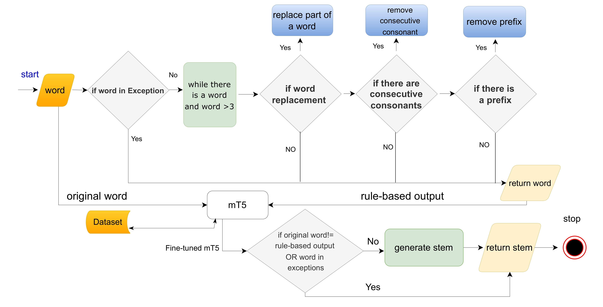

This repository is the official implementation of:  [Somstem: A Hybrid Stemmer for the Somali Language](https://ieeexplore.ieee.org/abstract/document/11527795) 
>📋 Somstem Architecture:



## Requirements

>📋 First, install the stemmer:
```
pip install directory/somstem/dist/somstem-0.1.0-py3-none-any.whl   
```
>📋 example in my case:   ```pip install D:/somali_hate_speech/somstem/dist/somstem-0.1.0-py3-none-any.whl```

Other requirements:
```
transformers                
torch                        
datasets                     
sentencepiece
pip install protobuf                           
```
  

## Usage 

>📋 Click [somstem](https://github.com/AMoffsom/Som_stem/releases/tag/V1.0) and download the somstem.zip file.
1. Download the project from the above provided link.
2. Extract the ZIP file to retrieve the Somstem folder. You may see a path like somstem/Somstem. Make sure to use the correct directory when accessing the files.
3. Place it in your project directory or any location of your choice.

### Sample Code

```
from  somstem.mt5_last import HybridStemmer
if __name__ == "__main__":

       hybrid_stemmer = HybridStemmer()
       while True:
        word_to_stem = input("Enter a word to stem or type 'quit' to exit: ")
        if word_to_stem.lower() == "quit":
            print("Exiting the program.")
            break
        stemmed_word = hybrid_stemmer.stem(word_to_stem)
        print(f"Original word: {word_to_stem}")
        print(f"Stemmed word: {stemmed_word}")
```

>📋 Output:

```
Enter a word to stem or type 'quit' to exit: xarunta
Original word: xarunta
Stemmed word: xarun
Enter a word to stem or type 'quit' to exit: 
```

If you find this repository helpful for your work, please cite our paper:

```
@INPROCEEDINGS{11527795,
  author={Badel, Abdisalam Mahamed and Tai, Wenxin and Xu, Xovee and Siraad, Abdikadir Maktal},
  booktitle={2026 8th International Conference on Natural Language Processing (ICNLP)}, 
  title={Somstem: A Hybrid Stemmer for the Somali Language}, 
  year={2026},
  pages={271-275},
  doi={10.1109/ICNLP69856.2026.11527795}}
```
